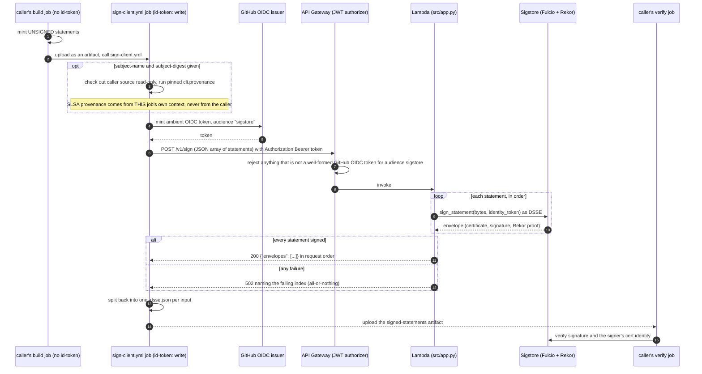

# Architecture

The mental model, the rules that must not be broken, and where things live.
For the request contract and adoption instructions see [`README.md`](README.md);
for day-to-day workflow see [`CONTRIBUTING.md`](CONTRIBUTING.md).

## 1. Executive overview

A CI pipeline produces a statement about a build ("this image scored 91"). That
statement is only worth anything if it is **signed by an identity a verifier
already trusts**, and if the party that built the artifact can't also forge the
signer's identity.

`lucid-attest-service` is that signer, run as a shared service instead of a
per-repository job. It has two halves that only make sense together:

- **A Lambda behind an HTTP API** (`POST /v1/sign`). It takes a batch of
  unsigned in-toto statements plus the caller's own GitHub Actions OIDC token and
  returns signed DSSE envelopes, using Sigstore keyless signing.
- **A reusable workflow** (`sign-client.yml`). The thing callers actually adopt.
  It mints the OIDC token, optionally constructs SLSA provenance from its own
  trusted context, calls the Lambda, and uploads the signed envelopes.

The reusable workflow is not a convenience wrapper; it is the trust anchor.
GitHub's `job_workflow_ref` OIDC claim (and so the Fulcio certificate identity)
reflects *the reusable workflow's own file path*, regardless of which repository
called it. That lets a verifier trust **one reviewed identity** for every caller.

Where it sits in the Lucid chain: `lucid-assay` (the scorer) builds unsigned
statements, this service signs them, and `lucid-dsse-collector` verifies and
stores the result. It reuses `lucid-assay`'s `cli.oidc_signer.sign_statement` for
the actual signing rather than reimplementing it.

## 2. Data flow

## 3. The non-negotiable invariants

**1. The signer identity comes from the reusable workflow, never from a caller's
own file.** Inlining the token-mint and `curl` into a caller's workflow would make
every caller its own unreviewed identity, and a verifier has no sound way to trust
an unbounded set of them. Callers must use `uses:`.

**2. Provenance is built here, from this job's own context.** The caller is
untrusted. The only provenance-relevant values it may supply are `subject-name`
and `subject-digest`; source binding and resolved dependencies come from this
job's own read-only checkout. `provenance.unsigned.json` is appended by the
workflow, not taken from `statement-files`, so a caller can't rename or omit it
to dodge or duplicate the signing pass.

**3. Signing is all-or-nothing.** If any statement in a batch fails, the whole
request fails closed with a `502` naming the index and reason. No partial list
that a caller would have to reconcile.

**4. No fabricated signatures, ever.** A failure path returns an error, never a
placeholder envelope. A stub would look real, which is worse than an error.

**5. The service never fetches its own OIDC token.** There is no ambient GitHub
Actions environment inside a Lambda. The caller's already-minted token travels
in `Authorization: Bearer` and is forwarded as-is to Sigstore.

**6. The API Gateway authorizer is a cost and abuse control, not an identity
check.** It rejects anything that isn't a well-formed GitHub Actions OIDC token
for audience `sigstore`, before a Lambda is invoked. It deliberately does *not*
establish which repository is calling (every legitimate caller has its own
identity; that is the point of a shared signer). `app.py`'s own header parsing
still runs behind it.

**7. Caller-supplied filenames are hostile.** `statement-files` entries containing
`/`, `\` or `..` are rejected, and `basename --` guards against a leading hyphen.

**8. One build, one artifact, verified before deploy.** The Lambda package is
built exactly once, in `build`, from a single pinned source (`ASSAY_CLI_SHA`).
`deploy` downloads that exact `.aws-sam/build/` output, re-derives its digest and
asserts it matches what was attested before `sam deploy` ever runs. It never
rebuilds. (Two independent builds from two pins once meant the attested digest
could not provably describe what got deployed.)

**9. The vendored surface is deliberately narrow.** Only `cli/__init__.py`,
`cli/common.py` and `cli/oidc_signer.py` are vendored from `lucid-assay`, because
the service signs bytes it already has in memory. Widen it only with a reason.

**10. Consumers pin by commit, and the pin lives in one place.** A change to
`sign-client.yml` reaches no caller until that caller repins, so a new input must
merge before a caller passes it. A caller's `--cert-identity` is derived by parsing
its own `uses:` line at runtime; never keep a second hand-maintained copy of the
SHA, because a bump PR only ever changes the `uses:` line.

**11. The stack is named exactly `lucid-attest-service`.** The deploy role's
CloudFormation permissions are scoped to that exact name.

**12. Signing mints permanent public records.** Every real signing call writes a
Rekor entry that can never be deleted. Nothing here runs on a schedule; the
end-to-end workflows are manual for that reason.

**13. Every call to the workflow is its own signing pass, and its artifact needs its own name.**
A caller may sign more than once per run (build-time statements, then a post-deploy
one). Each call mints its own OIDC token and signs independently as the same
reviewed identity, so nothing about one call constrains another -- except that
GitHub rejects two artifacts of one name in a run. `signed-artifact-name` (default
`signed-statements`, so existing callers are unaffected) exists for that, and the
output `artifact-name` reports what was used. A call that has no build artifact
omits `subject-name`/`subject-digest` and gets no SLSA provenance.

## 4. Directory architecture

| Path | Owns |
|---|---|
| `src/app.py` | The Lambda handler: request validation, `Authorization` parsing, batch signing, the `200`/`400`/`401`/`502` contract. |
| `src/requirements.txt` | The hash-pinned dependency closure actually shipped in the Lambda. Generated from `lucid-assay`'s `uv.lock` at the pinned SHA. |
| `template.yaml` | The SAM stack: the function, the HTTP API, the JWT authorizer (`issuer` GitHub, `audience` sigstore), `HOME=/tmp`, and the `SignEndpoint` output. |
| `.github/workflows/sign-client.yml` | The reusable signing workflow callers adopt. Inputs: `artifact-name`, `statement-files`, optional `subject-name`/`subject-digest`, optional `signed-artifact-name`. |
| `.github/actions/mint-sigstore-oidc-token/` | The composite action that mints the audience-`sigstore` token. Referenced **remotely** (`owner/repo/path@sha`), never by a local `./` path (which resolves against the caller's checkout). |
| `.github/workflows/assay.yml` | This repo's own pipeline: build (test, mutation testing, `sam build`), attest, verify, deploy, post-deploy-tests. |
| `.github/workflows/test-sign-client.yml`, `smoke-test-sign.yml` | Manual-only end-to-end proofs of the reusable workflow and the deployed endpoint. |
| `tests/test_app.py` | In-process tests of `handler()`. |
| `tests/live/` | Post-deploy tests against the real API Gateway and Lambda. See `CONTRIBUTING.md`. |
| `pyproject.toml`, `uv.lock`, `requirements-dev.txt` | The CI test and mutation-testing environment. Separate from `src/requirements.txt`, which is what ships. |
